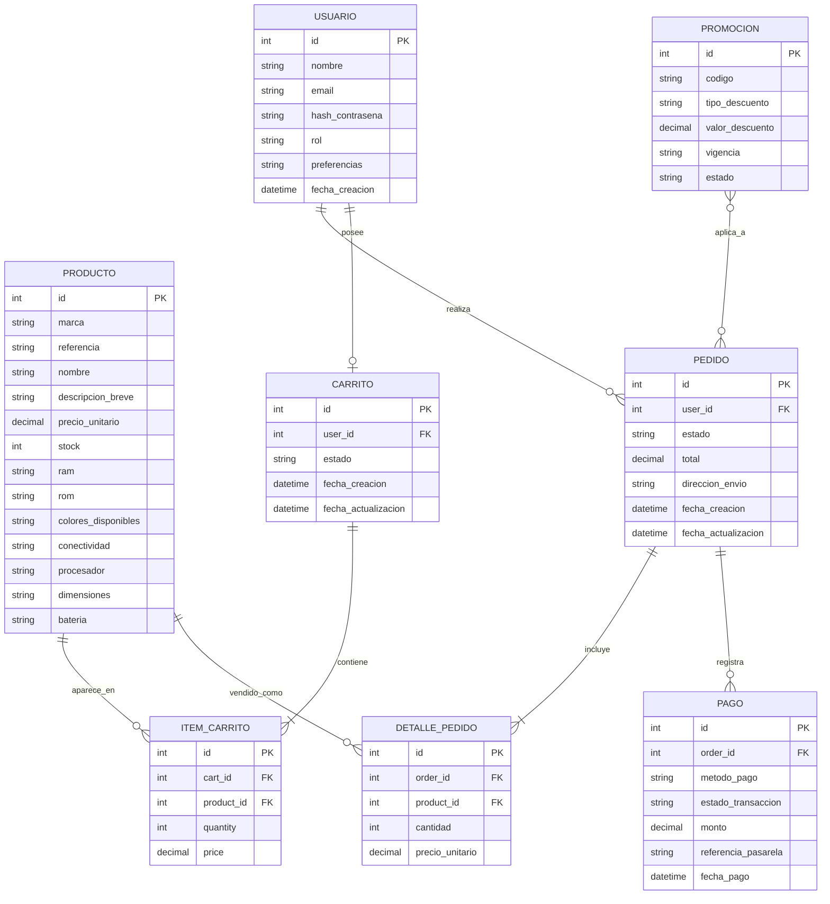
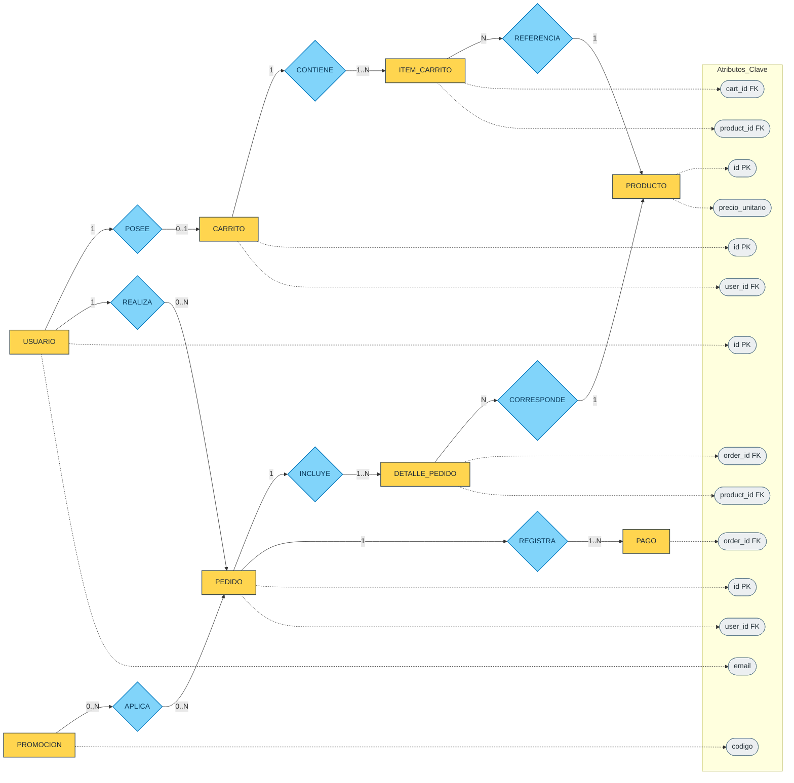

# Dominio y Modelo de Negocio - Movil-Dev Ecommerce

## 1. Vision del negocio

Movil-Dev busca vender productos tecnologicos en linea mediante una plataforma ecommerce que permita:

- Mostrar catalogo actualizado con stock en tiempo real.
- Ofrecer una experiencia de compra simple desde exploracion hasta pago.
- Gestionar usuarios, pedidos, pagos e inventario de forma segura y escalable.
- Soportar crecimiento de trafico y operacion continua.

## 2. Propuesta de valor

- Compra digital de productos Movil-Dev desde cualquier dispositivo.
- Informacion clara de productos (marca, referencia, especificaciones, precio y disponibilidad).
- Carrito persistente y proceso de checkout estructurado.
- Seguridad en autenticacion, sesiones y manejo de datos sensibles.
- Base para analitica y administracion del inventario y ventas.

## 3. Alcance funcional del dominio

### 3.1 Gestion de usuarios

- Registro y autenticacion (email y posibilidad de redes sociales).
- Login con mecanismos seguros (JWT/OAuth2).
- Perfil de usuario con historial y preferencias.
- Recuperacion de contrasena.

### 3.2 Catalogo de productos

- Visualizacion de productos con fotos, descripcion y precio.
- Filtros por categoria, precio y marca.
- Busqueda avanzada.
- Consulta de disponibilidad en tiempo real.

### 3.3 Carrito de compras

- Agregar, editar y eliminar productos del carrito.
- Persistencia de carrito:
- Usuarios autenticados: persistencia SQL.
- Usuarios no autenticados: sesion/cookies.
- Calculo de subtotal, impuestos y envio.
- Recuperacion del carrito al volver a iniciar sesion.

### 3.4 Checkout y pagos

- Integracion con pasarelas (Stripe/PayPal/tarjetas).
- Opcion de pago contra entrega.
- Confirmacion de compra y factura electronica.

### 3.5 Gestion de pedidos

- Creacion y seguimiento de estado del pedido (pendiente, enviado, entregado).
- Notificaciones de estado por email/SMS.
- Cancelaciones y devoluciones.

### 3.6 Administracion

- Panel administrativo para inventario.
- Reportes de ventas y metricas operativas.

## 4. Actores del negocio

- Cliente no autenticado: navega catalogo y construye carrito temporal.
- Cliente autenticado: compra, paga, consulta pedidos y administra su perfil.
- Administrador: gestiona productos, inventario y visibilidad de reportes.
- Sistemas externos:
- Pasarela de pagos (Stripe/PayPal).
- Servicio de notificaciones (correo/SMS).
- Infraestructura de despliegue y monitoreo.

## 5. Entidades principales del dominio

### 5.1 Usuario

- id
- nombre
- email
- hash_contrasena
- rol
- preferencias
- fecha_creacion

### 5.2 Producto

- id
- marca
- referencia
- nombre
- descripcion_breve
- precio_unitario
- stock
- atributos_tecnicos:
- ram
- rom
- colores_disponibles
- conectividad
- procesador
- dimensiones
- bateria

### 5.3 Carrito

- id
- user_id (nullable para invitados)
- estado
- fecha_creacion
- fecha_actualizacion

### 5.4 ItemCarrito

- id
- cart_id
- product_id
- quantity
- price

### 5.5 Pedido

- id
- user_id
- estado
- total
- direccion_envio
- fecha_creacion
- fecha_actualizacion

### 5.6 Pago

- id
- order_id
- metodo_pago
- estado_transaccion
- monto
- referencia_pasarela
- fecha_pago

### 5.7 Promocion

- id
- codigo
- tipo_descuento
- valor_descuento
- vigencia
- estado

## 6. Relaciones de dominio (alto nivel)

- Un Usuario puede tener uno o varios Pedidos.
- Un Usuario puede tener un Carrito activo.
- Un Carrito contiene muchos ItemCarrito.
- Cada ItemCarrito referencia un Producto.
- Un Pedido agrupa productos y se asocia a uno o varios pagos (segun estrategia de negocio).
- Un Pago pertenece a un Pedido.
- Una Promocion puede aplicarse al Carrito o al Pedido segun reglas.

## 7. Reglas de negocio clave

### 7.1 Reglas de carrito

- No se permite agregar productos inexistentes.
- No se permite agregar cantidades invalidas (<= 0).
- No se permite superar el stock disponible.
- El precio del item se toma desde el precio vigente del producto al momento de agregar (politica inicial).

### 7.2 Reglas de calculo

- Subtotal = suma(precio_item x cantidad_item).
- Impuestos = subtotal x tasa_impuesto_configurable.
- Envio = tarifa fija o dinamica por reglas de negocio.
- Total = subtotal + impuestos + envio - descuentos.

### 7.3 Reglas de seguridad

- Tokens y credenciales gestionados de forma segura.
- Cifrado de datos sensibles y uso de HTTPS/SSL-TLS.
- Acciones de administracion restringidas por rol.

### 7.4 Reglas de persistencia

- Carrito de autenticados: base de datos relacional.
- Carrito de invitados: sesion/cookies con politicas de expiracion.
- Recuperacion de carrito al reingresar con cuenta autenticada.

## 8. Procesos de negocio end-to-end

### 8.1 Flujo de compra

1. Cliente navega catalogo y consulta detalle de producto.
2. Cliente agrega productos al carrito.
3. Sistema valida stock y cantidades.
4. Sistema calcula subtotal, impuestos y envio.
5. Cliente procede a checkout y selecciona metodo de pago.
6. Sistema procesa pago con pasarela.
7. Sistema genera pedido, confirma compra y registra factura/notificacion.

### 8.2 Flujo de administracion de inventario

1. Administrador crea/edita producto.
2. Sistema valida campos y guarda cambios.
3. Inventario se refleja en catalogo y disponibilidad.
4. Reportes consolidan ventas y comportamiento de stock.

## 9. Requisitos no funcionales asociados al negocio

### Rendimiento

- Operaciones criticas con respuesta objetivo menor a 2 segundos.
- Soporte para picos de trafico con arquitectura escalable.

### Seguridad

- Cifrado de datos y comunicacion segura.
- Buenas practicas para gestion de secretos y credenciales.
- Base para cumplimiento de lineamientos tipo PCI-DSS.

### Usabilidad y accesibilidad

- Interfaz responsive y clara en desktop/movil.
- Lineamientos de accesibilidad (WCAG) como objetivo de calidad.

### Disponibilidad y operacion

- Objetivo de uptime de 99.9%.
- Estrategias de recuperacion y respaldo.

### Mantenibilidad

- Codigo modular y documentado.
- Integracion continua para despliegues frecuentes.

## 10. Arquitectura funcional resumida

- Frontend: experiencia de usuario, estado de carrito, autenticacion y consumo de API.
- Backend: reglas de negocio, validaciones, seguridad, exposicion de endpoints y orquestacion de pagos/notificaciones.
- Base de datos: persistencia transaccional de usuarios, productos, carrito, pedidos y pagos.
- DevOps/Infraestructura: CI/CD, contenedores, despliegue cloud, monitoreo y seguridad operativa.

## 11. Estado del desarrollo (segun plan de trabajo)

- Sprint 1: configuracion inicial completada.
- Sprint 2: gestion de usuarios completada.
- Sprint 3: backend de productos y persistencia completados; visualizacion y filtros aun en progreso.
- Sprint 4: carrito en desarrollo (endpoints, logica de totales, persistencia, migraciones y pruebas).
- Sprints 5 a 8: checkout/pagos, pedidos, optimizacion, seguridad, UX y despliegue final.

## 12. Pendientes prioritarios del dominio (carrito)

- Endpoint POST /cart/add con validacion de stock y datos.
- Endpoint DELETE /cart/remove/{id}.
- Manejo de errores para producto inexistente y cantidades invalidas.
- Endpoint GET /cart/total para exponer la logica de negocio.
- Parametrizacion de impuestos y envio en variables de entorno.
- Persistencia consistente del carrito entre sesiones.
- Pruebas de integracion del modulo de carrito.

---

Este documento define el dominio de negocio base de Movil-Dev Ecommerce y sirve como referencia para diseno funcional, implementacion tecnica y priorizacion de backlog.

## 13. Modelo Entidad-Relacion (ER)

Diagrama ER del ecommerce con entidades principales, claves y cardinalidades:

Notas de modelado:

- Se incluye `DETALLE_PEDIDO` para resolver la relacion N:M entre `PEDIDO` y `PRODUCTO`.
- `USUARIO` a `CARRITO` se modela como 1 a 0..1 para representar un carrito activo por usuario autenticado.
- `PROMOCION` a `PEDIDO` queda N:M para soportar cupones combinables (si el negocio no lo permite, puede cambiarse a 1:N).

## 14. Modelo ER en estilo visual (tipo presentacion)

Sugerencia de uso:

- Usa la seccion 13 para documentacion tecnica (PK/FK detalladas).
- Usa esta seccion 14 para presentaciones y explicacion funcional del modelo.
