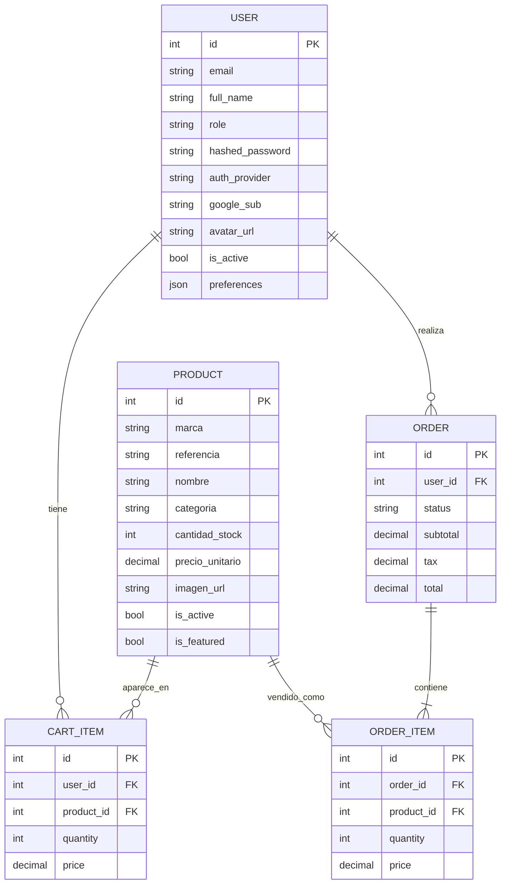

# Estructura y Validacion del Alcance - Movil-Dev

## 1. Descripcion general del sistema

Movil-Dev es una aplicacion ecommerce orientada a la venta de celulares y productos tecnologicos. El sistema permite que un cliente consulte productos, revise informacion tecnica, agregue productos al carrito, gestione su cuenta, realice checkout y consulte pedidos. Tambien contempla un rol administrador para gestionar productos e inventario.

El proyecto esta dividido en tres capas principales:

- Frontend: interfaz web desarrollada con React y Vite.
- Backend: API REST desarrollada con FastAPI.
- Base de datos: persistencia relacional con SQLAlchemy y migraciones.

El objetivo principal es construir un MVP funcional para demostrar el flujo de compra completo: registro/login, catalogo, carrito, checkout, pagos, ordenes y administracion basica de productos.

## 2. Validacion del alcance

### Checklist - alcance del sistema

| Categoria             | Pregunta                                                   | Respuesta | Validacion                                                                                                                                   |
| --------------------- | ---------------------------------------------------------- | --------: | -------------------------------------------------------------------------------------------------------------------------------------------- |
| Claridad del problema | ¿El problema esta claramente definido?                     |        Si | El problema es permitir que Movil-Dev venda productos tecnologicos en linea mediante un ecommerce.                                           |
| Claridad del problema | ¿Existe un usuario real identificado?                      |        Si | Se identifican cliente no autenticado, cliente autenticado y administrador.                                                                  |
| Claridad del problema | ¿Se entiende el valor del sistema?                         |        Si | El sistema digitaliza ventas, consulta de catalogo, gestion de carrito, pedidos e inventario.                                                |
| Alcance controlado    | ¿El sistema se puede desarrollar en el tiempo del curso?   |        Si | El MVP esta acotado a funcionalidades basicas de ecommerce; reportes avanzados, devoluciones y notificaciones completas quedan como mejoras. |
| Alcance controlado    | ¿Evita funcionalidades innecesarias?                       |        Si | El nucleo se centra en autenticacion, productos, carrito, pedidos y pagos.                                                                   |
| Alcance controlado    | ¿Tiene un MVP claro?                                       |        Si | El MVP es: usuario se registra, consulta productos, agrega al carrito, calcula total, hace checkout y genera orden.                          |
| Coherencia funcional  | ¿Las historias de usuario estan alineadas con el problema? |        Si | Las historias responden directamente al flujo de compra y administracion del catalogo.                                                       |
| Coherencia funcional  | ¿No hay contradicciones entre funcionalidades?             |        Si | Las funcionalidades se complementan: productos alimentan carrito, carrito alimenta pedidos y pagos.                                          |
| Coherencia funcional  | ¿Cada historia tiene criterios de aceptacion claros?       |        Si | Se definen criterios observables para registro, catalogo, carrito, checkout, pedidos y administracion.                                       |
| Modelo de datos       | ¿Las entidades cubren todas las funcionalidades?           |        Si | Usuarios, productos, carrito, items, ordenes y pagos cubren el MVP.                                                                          |
| Modelo de datos       | ¿No hay entidades redundantes?                             |        Si | Las entidades principales tienen responsabilidades separadas; promocion/reportes quedan fuera del MVP o como extension.                      |
| Modelo de datos       | ¿Las relaciones estan claras?                              |        Si | Usuario tiene carrito y ordenes; carrito contiene items; items referencian productos; orden contiene items.                                  |
| Arquitectura          | ¿Esta definida la separacion Backend / Frontend?           |        Si | El frontend consume servicios API y el backend concentra reglas de negocio y persistencia.                                                   |
| Arquitectura          | ¿Hay claridad sobre API y base de datos?                   |        Si | La API REST expone endpoints por modulo y SQLAlchemy gestiona la base de datos.                                                              |

## 3. Alcance del MVP

### Incluido en el MVP

- Registro e inicio de sesion de usuarios.
- Autenticacion con JWT.
- Perfil de usuario.
- Recuperacion/cambio de contrasena.
- Catalogo de productos.
- CRUD de productos para administradores.
- Subida de imagenes a Cloudinary.
- Carrito para usuarios autenticados.
- Carrito de invitado mediante cookies.
- Calculo de subtotal, impuesto y envio.
- Fusion de carrito invitado con carrito autenticado.
- Checkout basico.
- Creacion y consulta de ordenes.
- Integracion base con PayPal y ePayco.
- Pruebas unitarias, integracion, E2E backend y mantenibilidad.

### Fuera del MVP o pendiente

- Reportes avanzados de ventas.
- Promociones/cupones completos.
- Devoluciones.
- Facturacion electronica real.
- Notificaciones SMS o en tiempo real.
- Panel avanzado de administracion.
- Monitoreo productivo completo.
- Pruebas de carga y seguridad avanzadas.

## 4. Usuarios y roles

### Cliente no autenticado

Puede navegar el catalogo, consultar productos y construir un carrito temporal guardado en cookies.

### Cliente autenticado

Puede registrarse, iniciar sesion, actualizar informacion de envio, guardar carrito persistente, realizar checkout y consultar sus ordenes.

### Administrador

Puede crear, editar, activar, desactivar y eliminar productos. Tambien puede modificar configuraciones del carrito, como el porcentaje de impuesto.

## 5. Historias de usuario y criterios de aceptacion

### HU-01 Registro de cliente

Como cliente, quiero crear una cuenta para poder comprar productos y conservar mi informacion.

Criterios de aceptacion:

- El sistema permite registrar email, nombre y contrasena.
- El registro publico solo crea usuarios con rol cliente.
- Si el email ya existe, el sistema rechaza el registro.
- Al registrarse correctamente, el usuario queda disponible para login.

### HU-02 Inicio de sesion

Como cliente, quiero iniciar sesion para acceder a mi perfil, carrito y pedidos.

Criterios de aceptacion:

- El sistema valida email y contrasena.
- Si las credenciales son correctas, retorna un token JWT.
- Si las credenciales son invalidas, retorna error.
- El token permite consultar `/auth/me`.

### HU-03 Gestion de productos

Como administrador, quiero gestionar productos para mantener actualizado el catalogo.

Criterios de aceptacion:

- Solo un administrador puede crear productos.
- Solo un administrador puede editar productos.
- Solo un administrador puede eliminar productos.
- El sistema valida referencia unica, categoria, precio y stock.
- Los clientes pueden listar y consultar productos activos.

### HU-04 Carrito de compras

Como cliente, quiero agregar productos al carrito para preparar mi compra.

Criterios de aceptacion:

- No se pueden agregar cantidades menores o iguales a cero.
- No se pueden agregar productos inexistentes.
- No se puede superar el stock disponible.
- El carrito calcula subtotal, impuesto, envio y total.
- El usuario autenticado conserva su carrito en base de datos.
- El invitado conserva su carrito en cookies.

### HU-05 Checkout y orden

Como cliente, quiero confirmar mi carrito para generar una orden de compra.

Criterios de aceptacion:

- Si el carrito esta vacio, el sistema no crea orden.
- Si un producto esta inactivo, el sistema no crea orden.
- Si el precio cambio, el sistema solicita validar nuevamente.
- Si todo es valido, se crea una orden pendiente con sus items.

### HU-06 Pagos

Como cliente, quiero pagar mi compra por una pasarela para completar el pedido.

Criterios de aceptacion:

- El sistema calcula el total real del carrito antes de crear una sesion de pago.
- El sistema puede crear orden PayPal.
- El sistema puede crear sesion ePayco.
- Si faltan credenciales de pasarela, retorna error controlado.
- No se realizan llamadas externas en pruebas unitarias.

## 6. Modelo de datos

### Entidades principales actuales

| Entidad            | Responsabilidad                                                                                                |
| ------------------ | -------------------------------------------------------------------------------------------------------------- |
| User               | Guarda informacion del usuario, rol, credenciales, proveedor de autenticacion, preferencias y datos de perfil. |
| Product            | Guarda catalogo, referencia, marca, categoria, stock, precio, imagen y especificaciones tecnicas.              |
| CartItem           | Representa un producto agregado al carrito de un usuario autenticado.                                          |
| CartSettings       | Guarda configuraciones globales del carrito, como porcentaje de impuesto.                                      |
| Order              | Representa una compra generada desde el carrito.                                                               |
| OrderItem          | Guarda los productos incluidos en una orden.                                                                   |
| RevokedToken       | Guarda tokens JWT revocados por logout.                                                                        |
| PasswordResetToken | Guarda tokens temporales para recuperacion de contrasena.                                                      |

### Relaciones principales

- Un usuario puede tener muchos items de carrito.
- Un usuario puede tener muchas ordenes.
- Un producto puede aparecer en muchos items de carrito.
- Una orden contiene muchos order items.
- Cada order item referencia un producto.
- CartSettings centraliza la configuracion global de impuestos.

### Diagrama ER resumido



## 7. Arquitectura del sistema

### Separacion por capas

```text
Cliente Web
   |
   v
Frontend React/Vite
   |
   v
API REST FastAPI
   |
   v
Servicios de negocio
   |
   v
SQLAlchemy + Base de datos
   |
   v
Servicios externos: Cloudinary, PayPal, ePayco, Google OAuth
```

### Frontend

Responsabilidades:

- Renderizar interfaz de usuario.
- Manejar rutas de navegacion.
- Consumir la API mediante servicios.
- Guardar token JWT en cliente.
- Gestionar carrito y estado visual.
- Mostrar catalogo, checkout, perfil y dashboard.

Tecnologias:

- React.
- Vite.
- React Router.
- Axios.
- Tailwind CSS.
- Lucide React / React Icons.

### Backend

Responsabilidades:

- Exponer API REST.
- Validar datos de entrada.
- Aplicar reglas de negocio.
- Gestionar autenticacion y autorizacion.
- Persistir usuarios, productos, carrito y ordenes.
- Integrar pagos y almacenamiento de imagenes.

Tecnologias:

- FastAPI.
- SQLAlchemy.
- Pydantic.
- JWT.
- Cloudinary.
- PayPal/ePayco.
- Pytest para pruebas.

### Base de datos

Responsabilidades:

- Persistencia transaccional.
- Integridad de usuarios, productos, carrito y ordenes.
- Soporte para migraciones.

Componentes:

- `database/core/database.py`: conexion, sesiones y utilidades de esquema.
- `migrations/`: migraciones de base de datos.
- Modelos SQLAlchemy por dominio.

## 8. API principal por dominio

### Auth

- `POST /auth/register`
- `POST /auth/admin/register`
- `POST /auth/login`
- `POST /auth/google`
- `POST /auth/forgot-password`
- `POST /auth/reset-password`
- `GET /auth/me`
- `POST /auth/password`
- `POST /auth/me/avatar`
- `PATCH /auth/me/shipping`
- `POST /auth/logout`

### Products

- `GET /products`
- `GET /products/{product_id}`
- `POST /products`
- `PATCH /products/{product_id}`
- `DELETE /products/{product_id}`
- `PATCH /products/{product_id}/status`
- `POST /products/upload-image`

### Cart

- `GET /cart/items`
- `POST /cart/add`
- `DELETE /cart/remove/{item_id}`
- `GET /cart/total`
- `POST /cart/merge`
- `GET /cart/settings/tax`
- `PUT /cart/settings/tax`

### Orders

- `GET /orders/`
- `GET /orders/{order_id}`
- `POST /orders/`
- `POST /orders/paypal/mark-paid/{order_id}`
- `POST /orders/epayco/mark-paid/{order_id}`
- `POST /orders/order/mark-cancelled/{order_id}`

### Payments

- `POST /payments/paypal/create-order`
- `POST /payments/paypal/capture-order`
- `POST /payments/epayco/create-session`
- `GET /payments/epayco/confirmation`
- `POST /payments/epayco/confirmation`
- `POST /payments/paypal/webhook`

## 9. Estructura actual del proyecto

```text
Movil-Dev/
├── backend/
│   ├── auth/
│   │   ├── dependencies.py
│   │   ├── email_service.py
│   │   ├── models.py
│   │   ├── router.py
│   │   ├── schemas.py
│   │   └── services.py
│   ├── cart/
│   │   ├── models.py
│   │   ├── router.py
│   │   ├── schemas.py
│   │   └── services.py
│   ├── orders/
│   │   ├── models.py
│   │   ├── router.py
│   │   ├── schemas.py
│   │   └── services.py
│   ├── payments/
│   │   ├── router.py
│   │   ├── schemas.py
│   │   └── services.py
│   ├── products/
│   │   ├── models.py
│   │   ├── router.py
│   │   ├── schemas.py
│   │   └── services.py
│   ├── users/
│   │   ├── constants.py
│   │   ├── models.py
│   │   └── schemas.py
│   ├── cloudinary_utils.py
│   ├── flask_migrate_app.py
│   └── main.py
├── database/
│   └── core/
│       ├── database.py
│       ├── errors.py
│       └── security.py
├── frontend/
│   ├── public/
│   │   ├── favicon.png
│   │   └── icons.svg
│   ├── src/
│   │   ├── api/
│   │   │   ├── mappers/
│   │   │   │   ├── productMapper.js
│   │   │   │   └── productMapper.test.js
│   │   │   ├── services/
│   │   │   │   ├── authService.js
│   │   │   │   ├── cartService.js
│   │   │   │   ├── ordersService.js
│   │   │   │   ├── paymentService.js
│   │   │   │   └── productsService.js
│   │   │   └── axiosClient.js
│   │   ├── assets/
│   │   ├── components/
│   │   ├── context/
│   │   ├── App.jsx
│   │   ├── index.css
│   │   └── main.jsx
│   ├── package.json
│   ├── package-lock.json
│   ├── vite.config.js
│   └── vercel.json
├── migrations/
│   ├── versions/
│   │   ├── 20240424_add_discount_percent_to_product.py
│   │   └── c1844c8af97e_create_cart_items_table.py
│   ├── alembic.ini
│   ├── env.py
│   └── script.py.mako
├── tests/
│   ├── auth/
│   ├── cart/
│   ├── e2e/
│   ├── integration/
│   ├── maintainability/
│   ├── products/
│   ├── unit/
│   └── conftest.py
├── docs/
│   ├── dominio-modelo-negocio.md
│   └── testing.md
├── Dockerfile
├── README.md
├── requirements.txt
├── pyproject.toml
└── estructura_movil_dev.md
```

## 10. Pruebas y mantenibilidad

La suite de pruebas esta organizada por nivel:

- Unitarias: validan servicios y reglas de negocio aisladas.
- Integracion: validan endpoints reales de FastAPI con base SQLite aislada.
- E2E backend: validan el flujo completo de compra.
- Mantenibilidad: validan contratos publicos, rutas duplicadas y consistencia de API.
- Frontend: valida transformaciones del mapper de productos.

Comandos:

```powershell
.\.venv\Scripts\python.exe -m pytest -q
cd frontend
npm test
```

## 11. Conclusion de validacion

El alcance del sistema esta validado para un proyecto de curso porque tiene un problema claro, usuarios definidos, arquitectura separada, modelo de datos suficiente y un MVP concreto. La solucion evita crecer hacia funcionalidades complejas antes de terminar el flujo principal de compra.

La recomendacion es mantener como prioridad el flujo completo del MVP y dejar como fase posterior las funcionalidades de reportes avanzados, devoluciones, promociones completas, facturacion electronica y monitoreo productivo.
